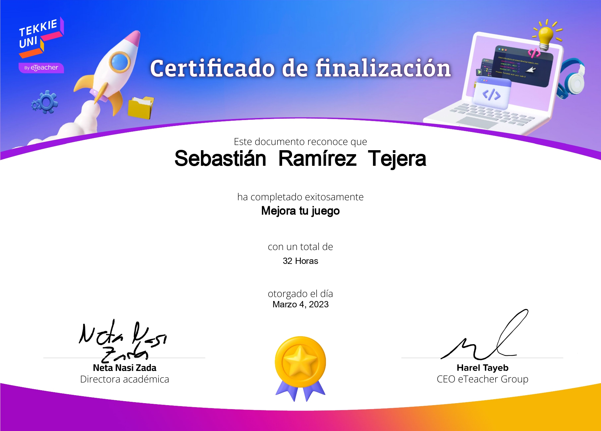

# Hola, soy Sebastián

Soy estudiante de Ingeniería de Software en INTEC con interés en el desarrollo de software, el desarrollo web y la ciberseguridad.

Actualmente continúo fortaleciendo mis conocimientos en C#, HTML, CSS y JavaScript. En este perfil comparto proyectos, prácticas y ejercicios que forman parte de mi proceso de aprendizaje y crecimiento profesional.

## Tecnologías y herramientas

- C#
- HTML
- CSS
- JavaScript
- Microsoft Excel
- Lucidchart

## Intereses

- Desarrollo de software
- Desarrollo web
- Ciberseguridad
- Resolución de problemas
- Aprendizaje continuo

## Certificaciones

<table>
  <tr>
    <td></td>
    <td></td>
    <td></td>
    <td></td>
  </tr>
</table>

Gracias por visitar mi perfil.
